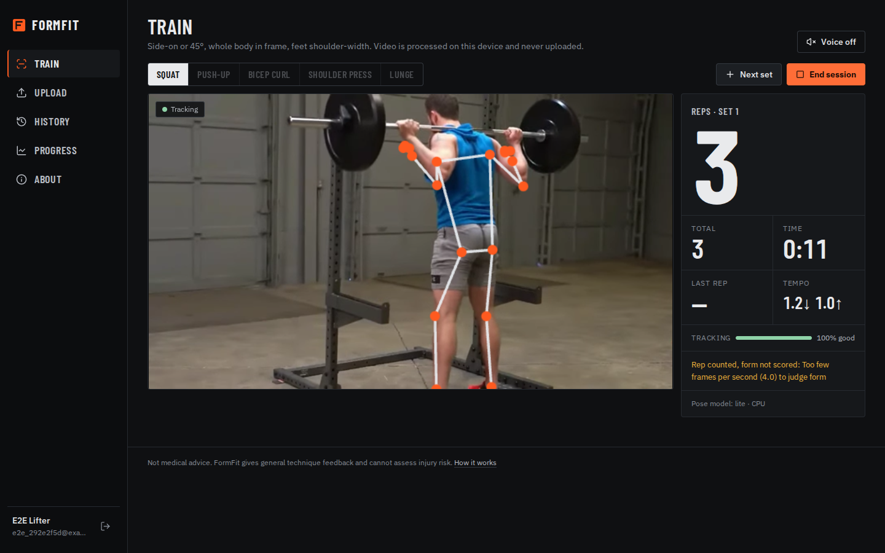
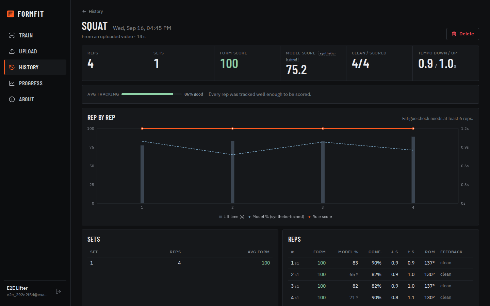
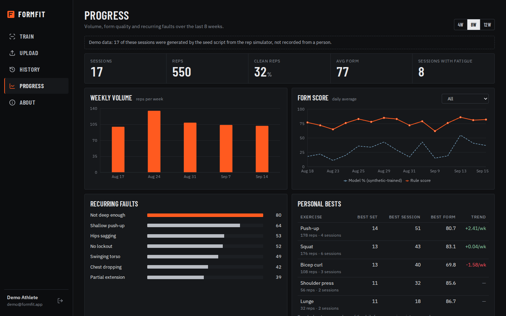
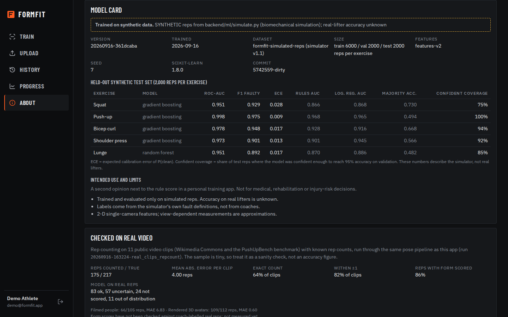
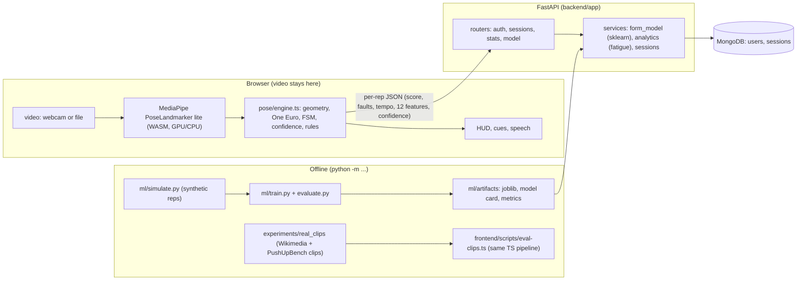
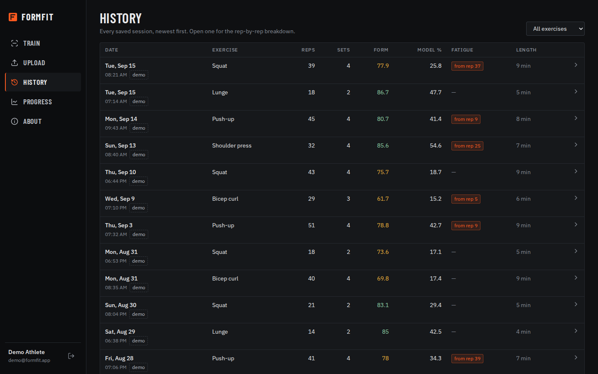
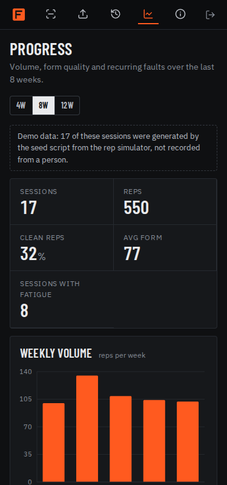

# FormFit

Browser-based rep counter and exercise-form feedback. Pose estimation runs on-device, and a FastAPI + MongoDB backend stores sessions, scores reps and tracks progress.

> Not medical advice. FormFit gives general exercise-technique feedback from a webcam. It cannot assess injury
> risk or replace a coach or a clinician.

## Demo

| Live session (fake webcam; headless Chromium runs at about 4 fps, so reps are counted but abstained from scoring) | Session detail (the sample clip in Upload mode) |
|---|---|
|  |  |
| **Progress (demo account, seeded data)** | **About / model card** |
|  |  |

All screenshots were taken by the Playwright e2e run against the running app (see [Screenshots](#screenshots)).

## Problem

People who train alone have no one to count reps or notice form breaking down, such as a squat that gets shallower or
a curl that turns into a swing. Commercial apps do this, but they usually upload video, and they rarely say how
reliable their feedback is.

## Solution

- Pose landmarks are computed **in the browser** with Google's pretrained MediaPipe PoseLandmarker. Video frames never
  leave the device.
- A small, unit-tested TypeScript pipeline turns landmarks into joint angles. It segments reps with a state machine and
  checks 17 explicit form rules.
- Every frame and every rep gets a **tracking-confidence** value. When tracking is poor, FormFit counts the rep but
  **does not score its form** ("Can't see your knees clearly") instead of guessing.
- The server stores only per-rep numbers. It adds a second opinion from a scikit-learn classifier (**trained on
  synthetic reps only**, and labelled as such everywhere), detects fatigue with a change-point test, and aggregates
  progress with MongoDB pipelines.
- Rep counting was evaluated on real public videos. The sample is tiny, and the results are reported below.

## Architecture



## AI/ML Pipeline

| # | Stage | Where | What exactly happens |
|---|---|---|---|
| 1 | Frame | `pages/Train.tsx`, `pages/Upload.tsx` | Live mode analyses every animation frame the detector keeps up with. Upload mode seeks the video at **15 analysed frames per second** and uses a fresh landmarker per file, with timestamps equal to video time, so the count does not depend on what ran before. |
| 2 | Pose estimation | `lib/pose-runtime.ts` | **MediaPipe PoseLandmarker, lite model** (`pose_landmarker_lite.task`, 5.6 MB), pretrained by Google and **not trained or fine-tuned here**. VIDEO running mode, `numPoses: 1`, detection and presence confidence 0.5. It returns 33 normalised landmarks, each with a `visibility` score. The GPU delegate is tried first, with CPU as the fallback. The WASM runtime is served locally. |
| 3 | Aspect correction | `pose/engine.ts` | MediaPipe normalises x by width and y by height, so x is multiplied by width/height before any angle is measured. Without this, 16:9 video distorts every angle. |
| 4 | Geometric features | `pose/rules.ts: frameMetrics`, `pose/angles.ts` | Primary joint angle (knee for squat and lunge, elbow for push-up, curl and press). Torso lean from vertical. Shoulder–hip–ankle line and signed hip offset (sag vs pike). Knee/ankle width ratio (valgus). Upper-arm–torso angle (elbow drift). Hip-below-knee depth in thigh lengths. Heel lift. Camera view from shoulder width / torso length (side < 0.35 < oblique < 0.45 < frontal); checks that a view cannot measure are switched off. The more visible body side is used, with 10-frame hysteresis. |
| 5 | Temporal smoothing | `pose/angles.ts: OneEuro` | **One Euro filter** (Casiez et al. 2012) per signal: `minCutoff = 1.2 Hz`, `beta = 0.015`, `dCutoff = 1.0 Hz`. It is an adaptive low-pass filter: smooth when the signal is still, low lag when it moves. |
| 6 | Rep segmentation | `pose/fsm.ts` | State machine `idle → top → down → bottom → top` on the smoothed primary angle. It has two thresholds with a hysteresis gap (e.g. squat top 150°, bottom 115°, gap 8°), a minimum rep time (0.6–0.8 s), a stall timeout, and partial-rep detection ("Go lower"). The press uses `180 − elbow angle` so every exercise starts "high". |
| 7 | Tracking confidence | `pose/confidence.ts` | **Per frame:** `visibility score × jitter score`. The visibility score maps landmark visibility 0.3→0 and 0.8→1, averaging the minimum and the mean over the required joints. The jitter score comes from the second difference of the raw angle (EMA, α = 0.15): noise ≤ 2° → 1, ≥ 10° → 0. **Per rep:** `mean frame confidence × (0.2 + 0.8 × share of frames with a usable pose) × frame-rate factor` (5 fps → 0, 10 fps → 1). |
| 8 | Per-rep features | `pose/engine.ts: aggregateRep` | min/max angle, ROM, eccentric/concentric time, max torso lean, torso sway, min hip line, min valgus ratio, max elbow drift, depth, heel rise. |
| 9 | Rule score | `pose/rules.ts: evaluateRep` | 17 fault rules with fixed penalties: `score = 100 − Σ penalties`. The same rules drive the live cues and the red joints. |
| 10 | Confidence-aware feedback | `pose/engine.ts`, `components/Stage.tsx` | Frame confidence < **0.4**: no live cues, no red joints, and the HUD says "Can't see your *knees* clearly". Rep confidence < **0.5** (or < 8 analysed frames/s): the rep is **counted but not scored** (`score: null`, `scored: false`, `abstain_reason`). |
| 11 | Model score (server) | `app/services/form_model.py` | One classifier per exercise gives `P(clean)`. If any feature is outside the training range (0.5–99.5% quantiles ± 10%), the status is `out_of_distribution` and no score is given. If `max(P, 1 − P)` is below the confidence that reached 95% accuracy on validation, the status is `uncertain`. Reps the browser did not score get `not_scored`. |
| 12 | Analytics (server) | `app/services/analytics.py` | Fatigue change-point per session. Weekly volume, daily scores, recurring faults and personal bests via `$facet` aggregation. |
| 13 | API → UI | `routers/`, `pages/` | Rule score, model score + status, rep confidence and abstain reason are shown per rep. The About page shows the model card and the measured evaluation numbers. |

### Form-quality classifier (synthetic)

- **Data: synthetic.** No public dataset has per-rep pose features with expert form labels. `ml/simulate.py` generates reps from a
  simplified biomechanical model (anthropometric segment ratios, ankle mobility, a sagittal balance model that forces more
  torso lean with long femurs, view-dependent landmark noise). A rep is labelled clean only if no fault holds on the **true**
  parameters, while the model sees the **noisy measured** ones.
- **Splits:** train (6,000), validation (2,000) and test (2,000) reps per exercise are three **independent simulator
  draws** with different seeds. Each split is hashed into the model card.
- **Models:** majority class, rules (Python mirror of the TS rules), logistic regression, random forest and gradient boosting,
  all on the same split. The model is selected by validation ROC-AUC. The decision threshold (max F1 of the faulty class) and the
  abstention confidence are also picked on validation. The test set is used once. Fitting is unweighted, so `P(clean)` stays
  calibrated (see ECE below).
- **Artifacts:** `ml/artifacts/form_model.joblib` (0.3 MB), `form_model.card.json` (model card), `metrics.json`.

### Fatigue detection

A per-rep fatigue index averages three relative changes against the median of the first 3 reps: slower concentric time,
smaller ROM and a lower score. A single least-squares mean-shift change point is fitted to that index. A set is flagged when the
shift is ≥ 0.12, the Welch t-statistic is ≥ 3.0 and the overall slope is positive (at least 6 reps). Details and
rates: [experiments/reports/fatigue_synthetic.md](experiments/reports/fatigue_synthetic.md).

### Not built on purpose

- **Automatic exercise recognition.** It was skipped because it could not be validated: the real clips available here are
  11 in total, with one curl and no press, and a classifier checked only on synthetic skeletons would be exactly the kind of unverified
  claim this project avoids. The user picks the exercise.

## Features

- **Train (live):** pick an exercise, start the camera, and get a mirrored video with a skeleton overlay. Joints turn red while a rule is broken.
  The HUD shows set reps, total reps, time, the last rep's score and tempo, and a **tracking-confidence meter**. Cues are
  throttled and can be spoken aloud (Web Speech API). Next set / End session buttons control the session.
- **Abstention:** "Step back so your whole body is visible" when joints are missing. "Can't see your knees clearly"
  when tracking is weak. "Rep counted, form not scored" when a rep's confidence is too low.
- **Upload:** analyses a recorded clip with the same pipeline (15 analysed fps) and saves it as a session.
  Try `samples/squat_demo.webm`.
- **History and session detail:** cursor-paginated list with an exercise filter and a fatigue flag. The detail page shows a rep chart
  (rule score, model score, lift time, set boundaries, fatigue marker), average tracking confidence, unscored reps with
  reasons, model status per rep (ok / uncertain / outside training range), and a delete action with a confirmation dialog.
- **Progress:** weekly volume, daily score trend, recurring faults, personal bests and trends. Demo sessions are labelled.
- **About:** pipeline, data sent to the server, model card, baseline table, real-video results and limitations.
- **Demo account:** `demo@formfit.app` / `demo1234`, with 30 days of **seeded demo data** generated by the simulator.
  It is labelled "demo data" in the UI.

## Tech Stack

- Frontend: React 19, Vite, TypeScript, react-router, recharts, lucide-react, plain CSS with self-hosted fonts (Barlow Condensed, IBM Plex Sans)
- Vision: `@mediapipe/tasks-vision` PoseLandmarker (WASM, lite model)
- Backend: FastAPI, Motor (MongoDB), pydantic v2, PyJWT, bcrypt
- ML: scikit-learn 1.8, NumPy, joblib
- Tests: pytest, vitest + @testing-library/react (jsdom), Playwright (Python, headless Chromium)
- Test-only tools: **ffmpeg** (turns the sample clip into a fake webcam for e2e), `mediapipe` + `opencv-python`
  (Python) for the real-clip evaluation

## Project Structure

```
backend/
  app/            main.py (lifespan, health, body limit, logging) · auth.py · config.py · ratelimit.py · security.py
    routers/      sessions.py · stats.py (/api/stats/overview, /api/model)
    services/     form_model.py (load once, abstain) · analytics.py (fatigue) · sessions.py (summaries)
  ml/             simulate.py · features.py · rules.py · train.py · evaluate.py · eval_fatigue.py · runinfo.py
    artifacts/    form_model.joblib · form_model.card.json · metrics.json · fatigue_eval.json · real_clips_eval.json
  scripts/        seed.py (demo user) · dump_landmarks.py (record a test fixture)
  tests/          API, ML, robustness (pytest, real MongoDB, throwaway DB)
frontend/
  src/pose/       angles.ts · fsm.ts · rules.ts · confidence.ts · cues.ts · engine.ts (+ __tests__)
  src/pages/      Train · Upload · History · SessionDetail · Progress · About · Login
  src/components/ Stage (video + HUD) · Feedback (confidence meter, toasts, dialogs, skeletons) · charts · Shell
  scripts/        copy-wasm.mjs · fetch-model.mjs · eval-clips.ts (real-clip replay through src/pose)
  public/models/  pose_landmarker_lite.task
experiments/      run.py · configs/ · real_clips/ (fetch, extract, evaluate) · results/ · reports/
data/real_clips/  manifest.json · README.md (downloaded clips and landmarks are git-ignored)
e2e/              test_e2e.py · run_e2e.sh
samples/          squat_demo.webm (CC BY 3.0) + ATTRIBUTION.md
docs/             AUDIT.md · screenshots/
```

## Installation

### Windows (PowerShell)

Prerequisites: Python 3.11+, Node 20+ (22 used here), and MongoDB Community running on `mongodb://127.0.0.1:27017`. Any webcam works.

```powershell
# backend
cd formfit\backend
python -m venv .venv
.venv\Scripts\activate
pip install -r requirements-dev.txt
copy .env.example .env
python -c "import secrets; print(secrets.token_urlsafe(48))"   # paste into JWT_SECRET in .env
python -m scripts.seed                                           # demo@formfit.app / demo1234

# frontend (second terminal)
cd formfit\frontend
npm install
```

### macOS / Linux

The same steps apply, with `source .venv/bin/activate` and `cp .env.example .env`.

Notes:

- `npm run dev` / `npm run build` first run `scripts/copy-wasm.mjs`, which copies the MediaPipe WASM runtime from `node_modules` into
  `public/mediapipe/wasm`, so no CDN is needed at runtime. They also run `scripts/fetch-model.mjs`, which downloads the pose model if it is missing.
- `form_model.joblib` is tied to the scikit-learn version (pinned `>=1.8,<1.9`). If `/api/health` reports
  `"status": "degraded"`, run `python -m ml.train`.
- Optional, only for the real-video evaluation: `pip install -r requirements-eval.txt`.

## Environment Variables

`backend/.env` (see `.env.example`):

| Name | Required | Default | Purpose |
|---|---|---|---|
| `ENV` | no | `development` | In `production`, a missing or placeholder `JWT_SECRET` stops startup. In development a random per-process secret is used, with a warning. |
| `JWT_SECRET` | yes (prod) | empty | HMAC key for tokens (at least 32 characters). Generate it with `python -c "import secrets; print(secrets.token_urlsafe(48))"`. |
| `JWT_EXPIRE_MINUTES` | no | `10080` | Token lifetime |
| `MONGO_URI` | no | `mongodb://127.0.0.1:27017` | MongoDB connection |
| `MONGO_DB` | no | `formfit` | Database name |
| `CORS_ORIGINS` | no | `http://localhost:5175,http://127.0.0.1:5175` | Allowed browser origins (comma-separated) |
| `LOG_LEVEL` | no | `INFO` | Logging level (request lines contain method, path, status and time only) |
| `MODEL_PATH` | no | `ml/artifacts/form_model.joblib` | Classifier artifact |
| `MAX_BODY_BYTES` | no | `1000000` | Request body limit (413), also enforced for chunked bodies |
| `LOGIN_MAX_FAILURES` / `LOGIN_WINDOW_SECONDS` | no | `10` / `900` | Failed-login limit per email + IP (429) |
| `STALE_SESSION_HOURS` | no | `6` | Live sessions left open longer than this are marked abandoned |

## Running Locally

```powershell
cd backend;  uvicorn app.main:app --reload --port 8003     # API + docs at http://localhost:8003/docs
cd frontend; npm run dev                                    # http://localhost:5175
```

Browsers only allow camera access on `localhost` or HTTPS. Use `http://localhost:5175`, not a LAN IP.

## Training

```bash
cd backend
python -m ml.train                  # ~35 s on 2 CPUs; writes ml/artifacts/{form_model.joblib, form_model.card.json, metrics.json}
python -m ml.eval_fatigue           # fatigue detector on simulated sets -> ml/artifacts/fatigue_eval.json
```

## Evaluation

- **Classifier (synthetic):** `ml/evaluate.py` computes accuracy, balanced accuracy, per-class precision/recall/F1,
  a confusion matrix, ROC-AUC, PR-AUC (faulty class), Brier score, ECE with a 10-bin reliability table, selective accuracy
  and coverage at the abstention confidence, and recall per fault type. ROC-AUC is the selection metric because the classes are
  imbalanced (27% clean squats) and the threshold is tuned separately. ECE and Brier matter because the UI shows `P(clean)` as a percentage.
- **Real video (rep counting):** `data/real_clips/manifest.json` lists public clips with licence, sha256, view,
  hand-counted reps and the counting method. `experiments/real_clips` downloads them, extracts landmarks with the **same
  `pose_landmarker_lite.task`** (MediaPipe Python, 15 fps like Upload mode), and replays them through
  `frontend/src/pose/engine.ts` via `npx tsx frontend/scripts/eval-clips.ts`. The rep-counting code under test is the app's
  own TypeScript. Metrics: MAE of the per-clip count, exact-match rate, within-±1 rate, and the share of reps whose form was scored.
- **Fatigue (synthetic):** flag rate per injected pattern, with an evaluation seed different from the tuning seed.

## Experiments

```bash
python -m experiments.run --config experiments/configs/form_classifier_synthetic.json [--save-model]
python -m experiments.run --config experiments/configs/form_classifier_small_data.json
python -m experiments.run --config experiments/configs/fatigue_synthetic.json
python -m experiments.run --config experiments/configs/real_clips_repcount.json
```

Each run writes `experiments/results/<timestamp>-<name>/` with a config snapshot, `env.json` (git commit, Python and
library versions), `metrics.json` and error files. See [experiments/README.md](experiments/README.md) for the run table.

## Results

All numbers below were produced on 2026-09-16 by the scripts in this repo. The source files are listed with each table.

### Synthetic (simulator) — `experiments/results/20260916-144949-form_classifier_synthetic`

Test set: 2,000 independently simulated reps per exercise. **Synthetic data only.**

| Exercise | Majority acc. | Rules acc. / ROC-AUC | Log. reg. ROC-AUC | Selected model | Model acc. / F1 faulty / ROC-AUC | ECE / Brier | Confident coverage (acc.) |
|---|---|---|---|---|---|---|---|
| Squat | 0.730 | 0.834 / 0.866 | 0.868 | gradient boosting | 0.900 / 0.929 / 0.951 | 0.028 / 0.077 | 75% (0.957) |
| Push-up | 0.494 | 0.967 / 0.968 | 0.965 | gradient boosting | 0.974 / 0.975 / 0.998 | 0.009 / 0.017 | 100% (0.974) |
| Bicep curl | 0.668 | 0.907 / 0.928 | 0.916 | gradient boosting | 0.932 / 0.948 / 0.978 | 0.017 / 0.049 | 94% (0.957) |
| Shoulder press | 0.566 | 0.914 / 0.901 | 0.945 | gradient boosting | 0.918 / 0.901 / 0.973 | 0.013 / 0.058 | 92% (0.950) |
| Lunge | 0.482 | 0.863 / 0.870 | 0.886 | random forest | 0.893 / 0.892 / 0.951 | 0.017 / 0.081 | 85% (0.937) |

"Confident coverage" is the share of test reps whose confidence reaches the level that gave 95% accuracy on validation.
With only 500 training reps, ROC-AUC drops by 0.001–0.034 (`...-form_classifier_small_data`).

Fatigue detector, **synthetic** 12-rep sets (`experiments/results/20260916-154342-fatigue_synthetic`, 300 sets per pattern × 3 exercises):
false alarms **4.0%**; detection 24% (mild progressive), 56% (strong progressive), 77% (sudden drop). The onset is located within 0.25–0.37 reps on average.

### Real video — `experiments/results/20260916-163224-real_clips_repcount`

**Rep counting only**, on 11 clips / 217 reps: the bundled Wikimedia clip plus 10 PushUpBench clips.
Six clips show filmed people and five show rendered 3D avatars. **This is a very small sample.**

| Subset | Clips | Count MAE (reps/clip) | Exact | Within ±1 | Counted / true |
|---|---|---|---|---|---|
| All | 11 | 4.00 | 64% | 82% | 175 / 217 |
| Filmed people | 6 | 6.83 | 67% | 83% | 66 / 105 |
| Rendered avatars | 5 | 0.60 | 60% | 80% | 109 / 112 |
| Hand-verified ground truth | 5 | 0.20 | 80% | 100% | 65 / 66 |

- 86% of counted real reps were confident enough to be form-scored.
- On real reps, the synthetic-trained model returned 83 `ok`, 57 `uncertain`, 24 `not_scored` and 11 `out_of_distribution`.
  Whether those scores are *right* is **not measured yet** (there are no fault labels).
- Browser (WASM) vs Python landmarks on the sample clip: mean difference 0.004 frame units, same 4-rep count
  (`20260916-162813-browser_parity`).
- Real-video form accuracy: **Dataset required before evaluation.** Real-set fatigue: **Dataset required before evaluation.**

The real results are much less clean than the synthetic ones: a shallow drop-squat clip got 0 of 40 reps counted.
The per-clip table is in [experiments/reports/real_clips_repcount.md](experiments/reports/real_clips_repcount.md).

## Error Analysis

From `experiments/results/20260916-144949-form_classifier_synthetic/errors.csv` (15 most confident errors per side and per exercise):

- **Missed faults are mostly faults the camera view hides.** All 9 missed squat knee-valgus reps (and 12 of 14 lunge ones)
  have `valgus_min = 1.0`, the neutral value used for side-on video, where valgus cannot be measured. No model can fix
  that. The fix is setup guidance (film from the front to check knees).
- **Press back arch** accounts for 13 of 15 press misses (fault recall 0.78): a small lean angle on a standing lifter is
  close to measurement noise.
- **False alarms are borderline clean reps**, e.g. a 0.47 s descent against a 0.5 s rule, or 47° measured lean for a true lean
  under 45°. Labels come from true parameters and features from noisy ones, so part of this error is irreducible.
- **Real clips** (`experiments/results/20260916-163224-real_clips_repcount/errors.json`): a shallow "drop squat" never goes below
  the 115° knee threshold, so 0 of 40 reps were counted. The first rep of both lunge clips is missed. Arm movement before a curl set was
  counted (+1, but those reps were not scored). The far ankle is hidden on side-on alternating lunges, so 25–32% of those reps were
  not scored. All kneeling box push-ups were outside the model's synthetic training range.

Full write-up: [experiments/reports/form_classifier_synthetic.md](experiments/reports/form_classifier_synthetic.md).

## API Documentation

Interactive docs: `http://localhost:8003/docs`. All endpoints except auth and health need `Authorization: Bearer <token>`.
Every session query filters by `user_id`. Errors are always `{"detail": ...}`.

| Method | Path | Purpose |
|---|---|---|
| POST | `/api/auth/register` | Create an account → token |
| POST | `/api/auth/login` | Sign in → token (429 after repeated failures) |
| GET | `/api/auth/me` | Current user |
| GET | `/api/health` | `status: ok / degraded`, DB state (503 if unreachable), model loaded, version, error |
| POST | `/api/sessions` | Start a session `{exercise, source}` |
| POST | `/api/sessions/{id}/finish` | `{reps[], duration_s}` → model scores + status, set summary, fatigue (409 if already finished) |
| GET | `/api/sessions?limit=&cursor=&exercise=` | Finished sessions, newest first, cursor pagination (no rep arrays) |
| GET | `/api/sessions/{id}` | Full session with reps |
| DELETE | `/api/sessions/{id}` | Delete a session |
| GET | `/api/stats/overview?weeks=&tz=` | Totals, weekly volume, daily scores, faults, bests, trends |
| GET | `/api/model` | Model card, metrics summary (synthetic), thresholds, real-clip evaluation summary |

Per-rep fields added in phase 2 (all optional on input, so old clients keep working): `score` may be `null`, plus `confidence`,
`scored`, `abstain_reason`, `model_confidence`, `model_status`, `model_ood`.

## Screenshots

| | |
|---|---|
|  |  |
| History (demo data) | Progress at 375 px width |

## Technical Deep Dive

**Why this pose model.** MediaPipe PoseLandmarker runs in the browser in real time on a laptop CPU, gives 33 body
landmarks with a per-landmark visibility score, and is maintained by Google. The lite variant was chosen for speed. The
full and heavy variants are more accurate but slower. No pose model is trained here. Running in the browser means no
video upload, no GPU server and no per-frame network round-trip.

**Why this preprocessing.** Angles are only meaningful in pixel space, which is why the aspect correction exists. That bug was found on the real
clip, where a rear view was read as side-on and produced false heel-lift faults. The One Euro filter was chosen over a
moving average because a fixed low-pass either lags at the bottom of a fast rep or jitters at rest. The view classifier
exists because some faults are only visible from some angles.

**Why a state machine.** It works online (no look-ahead). Hysteresis prevents double counts from threshold chatter, and the states give natural hooks
for tempo, partial reps and stalls. Peak detection on a buffered signal would need a delay and a prominence threshold
per exercise anyway.

**Baselines.** Rules are the first baseline and remain the live feedback. On the simulator the learned model beats them on
ROC-AUC for every exercise, but on push-ups the rules are nearly as accurate. Logistic regression shows how much the
non-linear interactions are worth, and the majority class shows what "accuracy" means under imbalance.

**Features.** The model receives the same 7–10 per-rep numbers the rules use, restricted per exercise. Pixels and raw
landmarks are not used, so the model stays small, explainable (feature importances are in `metrics.json`) and
independent of the camera resolution.

**Inference.** The joblib bundle is loaded once in the FastAPI lifespan, and scoring runs in a thread pool when a session is
finished (one batched `predict_proba` per session). Pose inference is entirely client-side.

**Confidence.** There are two separate questions. *Can we trust the measurement?* That is tracking confidence from visibility,
jitter, dropouts and frame rate, computed in the browser, and it gates rule scoring and cues. *Can we trust the classifier?*
That is the out-of-distribution check against the training range plus a validation-chosen confidence level. The UI shows
both, and "not scored" is a normal outcome.

**Failure modes.** Loose clothing and occlusion lower visibility. Side-on video hides valgus, and a frontal view hides lean
and depth. Low frame rates (slow devices) break tempo, which is why the frame-rate factor exists. A second person in the frame
can take over tracking (`numPoses: 1`). Alternating curls count the more visible arm. The classifier has only seen
simulated people.

**Metrics that matter.** For counting: absolute count error per set. For form: recall of real faults at a false-alarm
rate users tolerate, and calibration, because the UI shows a percentage. For the product: the share of reps that get a
trustworthy score at all (coverage).

**Data required.** Labelled real reps with coach fault labels, across views, body types and lighting. The app already stores
the per-rep feature vectors, so an opt-in labelling flow would create the dataset. Rep-count ground truth needs only
counted clips, and the manifest format supports adding them.

**Scaling.** The server receives about 20 numbers per rep. Stats use one `$facet` aggregation on an index, lists use
cursor pagination, and the heavy work runs on the client. Horizontal scaling is stateless apart from the in-memory login
rate limiter, which would move to Redis.

**What changes for production.** A real labelled dataset and recalibration on it. A persistent rate limiter. HTTPS
(required for the camera anyway). Token refresh and revocation. Model versioning stored with each scored rep (the version is
already in the card). Monitoring of the share of `out_of_distribution` / `not_scored` reps as a drift signal.

## Limitations

- The form classifier is trained on **synthetic** reps. Its accuracy on real lifters is **unknown**.
- Real-video evaluation covers rep counting only, on a tiny number of public clips. Form scores have not been validated
  against expert labels on real video: **not measured yet**.
- 2-D pose from one camera loses depth. Valgus, lean and depth are view-dependent approximations.
- The fatigue detector is evaluated on simulated sets only and misses most mild, gradual fatigue.
- Single person only. Headless e2e runs process only a few frames per second (CPU, no GPU).
- Not a medical device, and it makes no health or injury-risk claims.

## Future Work

- Opt-in labelling of saved reps ("was this rep clean?") to build a real dataset, then recalibrate or retrain on it.
- More real clips per exercise (push-up, curl, press) with frame-level rep annotations.
- Setup guidance based on the view classifier ("turn 45° so both knees are visible").
- Per-user thresholds (mobility differs) and velocity estimates with a calibration object.

## Testing

```bash
cd backend  && python -m pytest -q      # API (real MongoDB, throwaway DB), ML, robustness
cd frontend && npm test                 # pose modules, real recorded landmarks, React components (jsdom)
cd e2e      && ./run_e2e.sh             # Playwright journey; needs ffmpeg (bash: use Git Bash or WSL on Windows)
```

Last full run (2026-09-16): **pytest 44 passed**, **vitest 54 passed** (6 files), **Playwright e2e 2 passed**. `npm run build` is clean.

The e2e runner converts `samples/squat_demo.webm` to `.y4m` with **ffmpeg**, a test-only dependency. Chromium plays it as a
fake webcam (`--use-fake-device-for-media-stream`). The runner starts the backend on 8003 and `vite preview` on 5175, runs a live
session and an upload analysis, checks history, progress and the About page, and takes the screenshots. The headless run
uses `?delegate=cpu`. CI (`.github/workflows/ci.yml`) runs pytest with a MongoDB service plus the frontend unit tests and
build. It has not been run from this environment.

Sample video: "Squat - exercise demonstration video" by FitnessScape, CC BY 3.0, via Wikimedia Commons
(`samples/ATTRIBUTION.md`).

## License

MIT, see [LICENSE](LICENSE). The sample video and any downloaded evaluation clips keep their own licences (CC BY / CC BY-SA),
listed in `samples/ATTRIBUTION.md` and `data/real_clips/manifest.json`.
